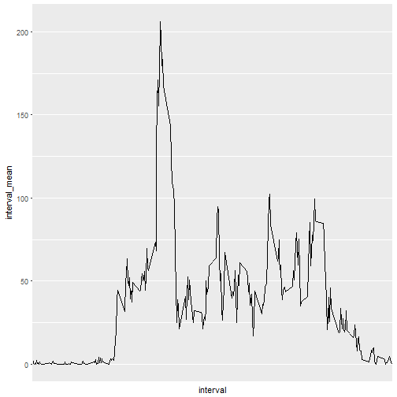
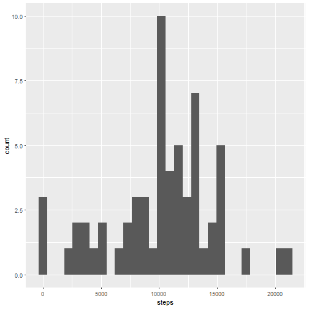
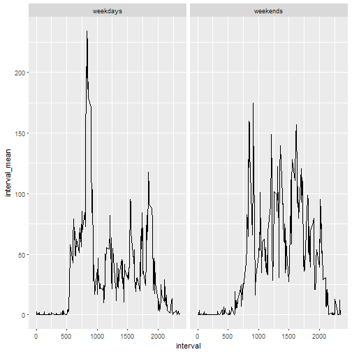

##Loading and preprocessing the data

1. First, load lubridate for changing date.
2. Read file and store in variable.
3. Transform date column into date format using lubridate. 


```r
library(lubridate)
activity<-read.csv("activity.csv",na.strings="NA")
activity$date<-ymd(activity$date)
```

## Q1: What is mean total number of steps taken per day?
1. Load ggplot2 and dplyr
2. Calculate and plot histogram of the total number of steps taken per day
3. Calculate and report the mean and median of the total number of steps taken per day


```r
library(ggplot2)
library(dplyr)
ggplot(activity,aes(x=date,y=steps))+geom_bar(stat="identity",na.rm=TRUE)
```

```
## Warning: Removed 2304 rows containing missing values (position_stack).
```


```r
sum_steps<-activity %>% group_by(date) %>% summarise(totalsteps=sum(steps,na.rm=TRUE))
print(paste("The median of the total number of steps is ",median(sum_steps$totalsteps),".",sep=""))
```

```
## [1] "The median of the total number of steps is 10395."
```

```r
print(paste("The mean of the total number of steps is ",mean(sum_steps$totalsteps),".",sep=""))
```

```
## [1] "The mean of the total number of steps is 9354.22950819672."
```

## Q2: What is the average daily activity pattern?
1. Calculate average number of steps taken of the 5-minute interval across all days.
2. Plot time series plot, adjust the x axis labels.
3. Report the 5-minute interval with maximum average number of steps.


```r
ave_steps_interval<-activity %>% group_by(interval) %>% summarise(interval_mean=mean(steps,na.rm=TRUE))
ggplot(ave_steps_interval)+
  geom_line(aes(x=interval,y=interval_mean),group=1)+
  scale_x_discrete(breaks=ave_steps_interval$interval[seq(1,288,by=36)])
```



```r
print(paste("The 5-minute interval with maximum average number of steps is ",
            ave_steps_interval[which.max(ave_steps_interval$interval_mean),1][[1]],".",sep=""))
```

```
## [1] "The 5-minute interval with maximum average number of steps is 835."
```

##Q3: Imputing missing values
1. Calculate and report the total number of missing values in the dataset
2. To fill in all missing values, take mean of the steps of same interval from the nearby two days (one day before and one day after), if either    of them does not exist (the first and last day), take half of the steps of the same interval from the only nearby day.


```r
tapply(is.na(activity$steps),activity$date,sum)
```

```
## 2012-10-01 2012-10-02 2012-10-03 2012-10-04 2012-10-05 2012-10-06 
##        288          0          0          0          0          0 
## 2012-10-07 2012-10-08 2012-10-09 2012-10-10 2012-10-11 2012-10-12 
##          0        288          0          0          0          0 
## 2012-10-13 2012-10-14 2012-10-15 2012-10-16 2012-10-17 2012-10-18 
##          0          0          0          0          0          0 
## 2012-10-19 2012-10-20 2012-10-21 2012-10-22 2012-10-23 2012-10-24 
##          0          0          0          0          0          0 
## 2012-10-25 2012-10-26 2012-10-27 2012-10-28 2012-10-29 2012-10-30 
##          0          0          0          0          0          0 
## 2012-10-31 2012-11-01 2012-11-02 2012-11-03 2012-11-04 2012-11-05 
##          0        288          0          0        288          0 
## 2012-11-06 2012-11-07 2012-11-08 2012-11-09 2012-11-10 2012-11-11 
##          0          0          0        288        288          0 
## 2012-11-12 2012-11-13 2012-11-14 2012-11-15 2012-11-16 2012-11-17 
##          0          0        288          0          0          0 
## 2012-11-18 2012-11-19 2012-11-20 2012-11-21 2012-11-22 2012-11-23 
##          0          0          0          0          0          0 
## 2012-11-24 2012-11-25 2012-11-26 2012-11-27 2012-11-28 2012-11-29 
##          0          0          0          0          0          0 
## 2012-11-30 
##        288
```

```r
activity2<-activity
for(i in seq_along(activity2$steps)){
  if(is.na(activity2$steps[i])){
    if(i<=288){
      activity2$steps[i]<-as.integer(activity2$steps[i+288]/2)
    }
    else if(i>288&i<=length(activity2$steps)-288){
      activity2$steps[i]<-as.integer(mean(c(activity2$steps[i-288],activity2$steps[i+288]),na.rm=TRUE))
    }
    else if(i>length(activity2$steps)-288){
      activity2$steps[i]<-as.integer(activity2$steps[i-288]/2)
    }
  }
}

ggplot(activity2,aes(x=date,y=steps))+geom_bar(stat="identity",na.rm=TRUE)
```



```r
sum_steps2<-activity2 %>% group_by(date) %>% summarise(totalsteps=sum(steps,na.rm=TRUE))
print(paste("The median of the total number of steps is ",median(sum_steps2$totalsteps),".",sep=""))
```

```
## [1] "The median of the total number of steps is 10571."
```

```r
print(paste("The mean of the total number of steps is ",mean(sum_steps2$totalsteps),".",sep=""))
```

```
## [1] "The mean of the total number of steps is 10234.1639344262."
```

These values differs from the first part of the assignment. My way of imputing missing values increase the estimation of the total daily steps.

##Q4 Are there differences in activity patterns between weekdays and weekends?
1. Create a new factor for weekends and weekdays.
2. Take means of steps of the 5-minute interval across weekdays and weekends.


```r
week_day<-c(rep("weekdays",5),rep("weekends",2))
names(week_day)<-unique(weekdays(activity$date))
activity<-cbind(activity,"week_day"=as.factor(week_day[weekdays(activity$date)]))
ave_steps_interval2<-activity %>% group_by(interval,week_day) %>% summarise(interval_mean=mean(steps,na.rm=TRUE))
ggplot(ave_steps_interval2)+
  geom_line(aes(x=interval,y=interval_mean),group=1)+facet_grid(.~week_day)
```



It is not suprise to see that during weekdays, mean steps are high around 9 a.m. and 6 p.m., which correspond to start and end of working hours, while during weekends such pattern disappears.
